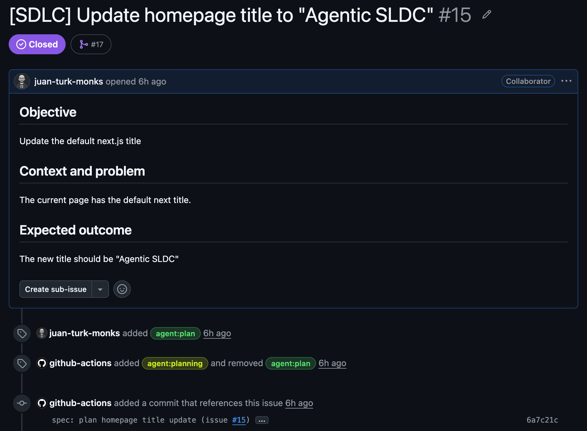
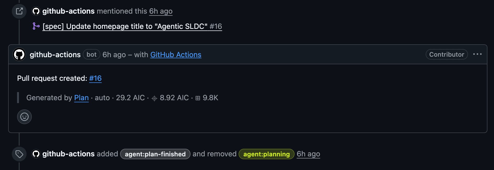
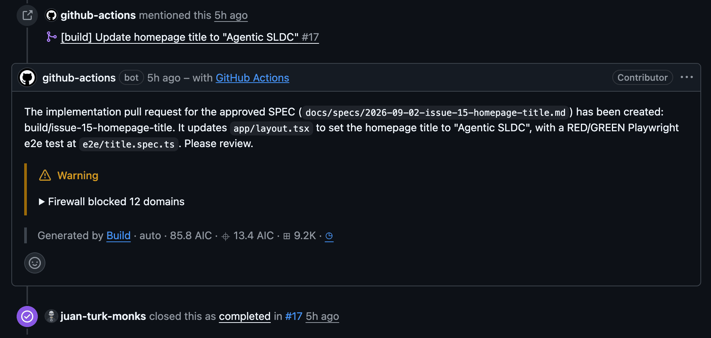

I believe today’s artificial intelligence is good enough to replace any developer.

Indeed, today, we have models capable of operating with almost any programming language and generating code as good as any senior developer. Agents are capable of researching, proposing a solution, modifying files, validating, and opening a PRs autonomously.

I have been working in the software industry for more than fifteen years. That is the very reason why I do not want to seek shelter in methodologies of the past and act as if the revolution were not occurring. It is already happening.

An agent's ability to write code does not mean that we should give it full control of a product, platform, or organization. For this transformation to be useful for a company, any agent decision must be reviewable, adjustable, or cancellable if necessary.

This is what I have tried to solve by transforming my SDLC (Software Development Life Cycle) into an Agentic SDLC.

I'm using this particular [issue](https://github.com/juanem1/agentic-sdlc/issues/15) as a running example throughout this post.

## The problem is not technical: it's about control.

The classic development process tends to concentrate too many decisions on one person. This person receives an issue, understands the request, researches the repository, clarifies all the questions, decides on a way of solving this issue, implements the solution, and finally opens a PR.

However, when we put one or more agents in this place, it becomes easy to boil this process down to one prompt: `Implement this issue and open a PR.`

The first problem I see is that usually, the issue does not include everything necessary to make a correct decision. There can be some technical constraints, some product decisions made in the past, some edge cases, or even the actual acceptance criteria of the business.

The question here is how to allow the agent to make decisions on real problems without allowing the mistake to sneak in the production environment unnoticed.

For a senior developer, tech lead, or CTO, this is the balance that we look for: how to use the speed of the agents without making software development a black box.

## This agentic flow and what it does.

This agentic flow is not a chatbot that we tell to implement some code. It is a controlled process where we keep humans in control of the code and the project while agents operate on the artifacts and the rules stored in the repository.

In my [agentic workflows](https://github.github.com/gh-aw/) implementation, I use issues as the starting point. Each change passes through two separate phases: **planning** and **implementation**.

The first phase does not include any code writing. An agent researches the request and the context of the repository. If it detects any ambiguity, it goes back to the issue and asks specific questions. It does not guess or opens a PR.

If the request is clear, it generates two artifacts: a specification (SPEC) and an ordered task list. These files are committed to the repository and are subject to review in their own PR.

Only when the person approves and merge this plan, another agent starts the implementation process. The result of the implementation phase is a second PR, this time containing code.

Here is the summary of this process:

`Issue → planning PR with the SPEC → agent build → implementation PR`

This is how a complex problem is divided into decisions agents can execute and humans can govern.

## The separation of planning and implementation changes the discussion.

This separation may seem to be just a technical matter, but it has an important operational impact.

When the same agent works on the ambiguous request and implements the code at once, most of the time we discover the mistake after it finishes all the work. This means that we need multiple iterations to solve this problem.

On the contrary, the review of the [SPEC](https://github.com/juanem1/agentic-sdlc/pull/16) allows us to discuss the intent of the change before implementation. The planning PR answers all the questions that the code diff is unable to answer: what is the problem that we are trying to solve, what is not in the scope, what risks are involved, and how to validate the result.

Finally, the code PR has the contract against which it can be validated. The review is no longer the blind reading but the examination of one concrete question: did the implementation respect what we approved?

This does not deprive the agent of the autonomy. This gives it the boundary inside which it can decide and execute its decisions much faster.

## The repository is used as the source of truth.

Working with chat-based agents often leads to lost context. This approach works well for standalone tasks, but it quickly falls apart when team members take over, models change, or we need to audit why a particular decision was made.

Therefore, in this flow, the SPEC and task list are stored in the repository. They are linked to the original issue, planning PR, and implementation PR.

This provides the advantage that matters for both engineering and business: traceability.

If someone needs to know the details of the change, he does not need to recover the agent's conversation. Instead, he can restore the context from the artifacts: the issue, the specification, the tasks, commits, and PRs.

It is an important difference. AI can participate in decision-making, but the institutional memory is still the property of the company.

## Human review is the governance mechanism.

Human review in this model does not exist due to the incapability of the agent to program the code. Human review exists because the company needs the ability to intervene in the decisions that affect the product, customer, security, or operations.

The agent can investigate, propose, implement, and document. But it is a person who adjusts the direction before the code is written, adjusts the decisions during the review, or cancels the whole process.

This *man in the middle* is not supposed to be the bottleneck. With a good design, this person does not need to review every line or execute every step. He reviews only the moments requiring the decision: intent, risks, exceptions, and final approval.

## Autonomy needs a contract.

Agents are already able to perform much of the work that traditionally required hours from the developer: investigating the conventions, breaking down the work, modifying the code, validating, and creating PRs. Thus, a great opportunity opens for accelerating the delivery process.

However, the speed without any rules leads only to mistakes. In order to delegate with confidence, the company needs to specify the trigger conditions for the work of the agent, the context that the agent must investigate, the moments when it needs help, the evidence it leaves behind, and who approves, adjusts, or cancels the decision.

I do not think that the future of software development is the company without developers or without any decision-making. I think the roles will change.

Developers will not disappear, but their role will shift to higher levels: defining, reviewing, and orchestrating the autonomy of the agents.
